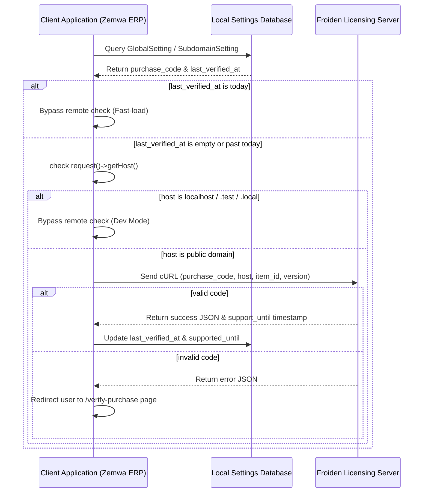

Listed directory Functions
Viewed EnvatoUpdate.php:1-142
Viewed FroidenApp.php:1-89

Here is a detailed guide on how the original Froiden license check works, followed by a complete blueprint for designing your own **Zemwa-License** system.

---

### Part 1: How the Froiden License Check Works
The original developer implemented the license check as a local Laravel module rather than a remote Composer dependency. This makes it easier to bundle directly with the app.

Here is the flow of the current package:



#### Core Components in the Codebase:
1. **Autoloading Namespace**: In [`composer.json`](file:///d:/dev-projects/dev-mithuntc/mbtech-projects/zemwa/zemwa-erp/zemwa-erp-mono-repo/composer.json#L163), the `"Froiden\\Envato\\"` namespace is mapped directly to `froiden-verify/src/`.
2. **Application License Logic ([`AppBoot.php`](file:///d:/dev-projects/dev-mithuntc/mbtech-projects/zemwa/zemwa-erp/zemwa-erp-mono-repo/froiden-verify/src/Traits/AppBoot.php))**: Runs during auth/boot cycles to verify the primary CRM license.
3. **Module License Logic ([`ModuleVerify.php`](file:///d:/dev-projects/dev-mithuntc/mbtech-projects/zemwa/zemwa-erp/zemwa-erp-mono-repo/froiden-verify/src/Traits/ModuleVerify.php))**: Verifies addon module licenses (like the Subdomain module) individually.
4. **Verification Helper ([`EnvatoUpdate.php`](file:///d:/dev-projects/dev-mithuntc/mbtech-projects/zemwa/zemwa-erp/zemwa-erp-mono-repo/froiden-verify/src/Functions/EnvatoUpdate.php))**: Handles the remote cURL request.
5. **Config File ([`froiden_envato.php`](file:///d:/dev-projects/dev-mithuntc/mbtech-projects/zemwa/zemwa-erp/zemwa-erp-mono-repo/config/froiden_envato.php))**: Defines target API URLs, database models (`\App\Models\GlobalSetting`), and redirection routes.

---

### Part 2: Blueprint for your own "Zemwa-License" System
If you plan to customize this ERP and distribute it to your own clients, you should build a **Zemwa-License** package. This will require two parts: a central server that issues and validates license keys, and a client-side verification package integrated into the ERP code.

---

#### Step 1: Create the Zemwa Licensing Server
This is a central Laravel application hosted by you (e.g., `licenses.zemwa.in`) that manages all client licenses.

##### **1. Database Schema (Licensing Server)**
Create tables to track your clients, products, and active licenses.
* **`products` Table**: For apps like ERP, HR, Recruit, Payroll.
* **`licenses` Table**:
  ```php
  Schema::create('licenses', function (Blueprint $table) {
      $table->id();
      $table->string('license_key')->unique(); // e.g., UUID
      $table->foreignId('product_id')->constrained();
      $table->string('client_name');
      $table->string('client_email');
      $table->string('allowed_domain'); // e.g., clienterp.com or erp.client.com
      $table->enum('status', ['active', 'suspended', 'expired'])->default('active');
      $table->timestamp('expires_at')->nullable();
      $table->timestamps();
  });
  ```

##### **2. Verification API Route**
Expose a POST endpoint: `/api/license/verify`
```php
public function verify(Request $request)
{
    $request->validate([
        'license_key' => 'required',
        'domain' => 'required',
        'product' => 'required',
    ]);

    $license = License::where('license_key', $request->license_key)
        ->where('allowed_domain', $request->domain)
        ->first();

    if (!$license) {
        return response()->json(['status' => 'error', 'message' => 'Invalid license or domain mismatch.'], 401);
    }

    if ($license->status !== 'active' || ($license->expires_at && $license->expires_at->isPast())) {
        return response()->json(['status' => 'error', 'message' => 'License has expired or is suspended.'], 403);
    }

    return response()->json([
        'status' => 'success',
        'message' => 'License is verified',
        'expires_at' => $license->expires_at?->toIso8601String(),
    ]);
}
```

---

#### Step 2: Create the Zemwa License Client Package
You can create a directory in the root called `zemwa-verify` and autoload it in `composer.json` using PSR-4:
```json
"autoload": {
    "psr-4": {
        "App\\": "app/",
        "Zemwa\\Verify\\": "zemwa-verify/src"
    }
}
```

##### **1. Local Database Migration on the Client's ERP**
Store the verified license state inside your client's database settings table (e.g. `global_settings`):
* `zemwa_license_key` (String)
* `zemwa_license_status` (String)
* `zemwa_license_expires_at` (Timestamp)
* `zemwa_last_verified_at` (Timestamp)

##### **2. The Verification Trait (`ZemwaVerify.php`)**
```php
<?php

namespace Zemwa\Verify\Traits;

use Carbon\Carbon;
use Illuminate\Support\Facades\Http;
use App\Models\GlobalSetting;

trait ZemwaVerify
{
    public function checkZemwaLicense()
    {
        $setting = GlobalSetting::first();
        $domain = request()->getHost();

        // 1. Bypass check on local development environments
        $localDomains = ['localhost', '127.0.0.1', '::1'];
        if (in_array($domain, $localDomains) || str_ends_with($domain, '.test') || str_ends_with($domain, '.local')) {
            return true;
        }

        // 2. Check if a check was already successfully completed today (reduces API load)
        if ($setting->zemwa_last_verified_at && Carbon::parse($setting->zemwa_last_verified_at)->isToday()) {
            return $setting->zemwa_license_status === 'active';
        }

        // 3. Make the API Call to your licensing server
        try {
            $response = Http::post('https://licenses.zemwa.in/api/license/verify', [
                'license_key' => $setting->zemwa_license_key,
                'domain' => $domain,
                'product' => 'zemwa-erp',
            ]);

            if ($response->successful()) {
                $setting->update([
                    'zemwa_license_status' => 'active',
                    'zemwa_last_verified_at' => now(),
                    'zemwa_license_expires_at' => $response->json('expires_at'),
                ]);
                return true;
            }
        } catch (\Exception $e) {
            // Optional: If your license server is temporarily down, allow fallback access
            return $setting->zemwa_license_status === 'active';
        }

        // License invalid, update status
        $setting->update(['zemwa_license_status' => 'invalid']);
        return false;
    }
}
```

##### **3. Hooking the Middleware**
Create a middleware `VerifyZemwaLicense` and register it in `app/Http/Kernel.php` to protect routes (like the Super Admin panel or logins):
```php
public function handle($request, Closure $next)
{
    if (!$this->checkZemwaLicense()) {
        return redirect()->route('zemwa.license.invalid');
    }
    return $next($request);
}
```

---

#### Step 3: Best Practices for Securing Your License Check Code
Since PHP is an open-source, interpreted language, any client with developer access can bypass the check by simply editing the trait to `return true` (just like we did earlier). 

To protect your system from piracy when distributing it to clients:
1. **Use PHP Obfuscation & Encryption**:
   Encode and encrypt your core checking logic files (e.g. `ZemwaVerify.php`, the middleware, and key service providers) using tools like **SourceGuardian**, **IonCube Encoder**, or **Zend Guard**. This converts your PHP files into encrypted byte-code so they cannot be read or edited by clients.
2. **Scatter the Checks**:
   Do not just put checks in one place called `isLegal()`. Embed checks in vital operations of the app (e.g., inside database boot steps, generating PDF reports, loading layouts, or saving projects). If they bypass the main check, other components will break.
3. **Remote Configuration Injection**:
   Make your licensing server return more than just a `success` message. For example, have it return crucial API credentials or database keys that are stored temporarily in session memory. Without a connection to the license server, the app is missing vital configuration files to execute properly.


   